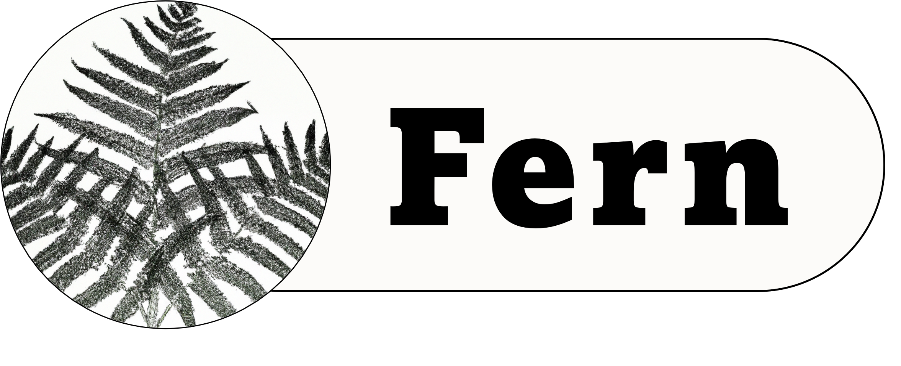

# Fern

<!--toc:start-->
- [Fern](#fern)
  - [What is Fern?](#what-is-fern)
  - [Features](#features)
<!--toc:end-->

A CSV Parser written in Rust

## What is Fern?
Fern is a Rust package that turns a CSV file into an array of objects

## Features
* Turn a CSV file into an array of objects